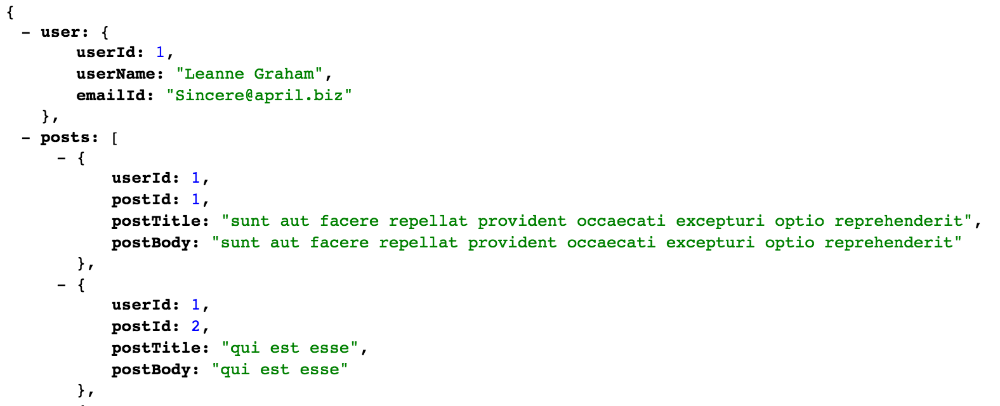

Poseidon Sample
===============

Poseidon Sample helps as a reference to build new applications using Poseidon.

## To run from command line

1. Build and install sample using maven
```mvn clean install```
2. Start sample application using ```sudo ./run.sh```
3. Access the [API](http://localhost:21000/v1/userPosts?userId=1)

## To run from IDE

Main class: com.flipkart.poseidon.Poseidon

VM options: -Dcom.sun.management.jmxremote.port=3335 -Dcom.sun.management.jmxremote.ssl=false -Dcom.sun.management.jmxremote.authenticate=false -Dlog4j.configurationFile=src/main/resources/external/log4j.xml -DLog4jContextSelector=org.apache.logging.log4j.core.async.AsyncLoggerContextSelector

Program arguments: src/main/resources/external/bootstrap.xml

Working directory: <path_to_poseidon_repo>/sample

Classpath: sample (module)

## What it does

It has a sample service client to a dummy online [REST API Service](http://jsonplaceholder.typicode.com).

It exposes an [API](http://localhost:21000/v1/userPosts?userId=1) to fetch user details and all posts of a given user.

Internally it makes parallel calls to online REST API to get [user details](http://jsonplaceholder.typicode.com/users/1) and to get [all posts](http://jsonplaceholder.typicode.com/posts?userId=1) of the user. It composes a final response out of these two service responses as seen in [API](http://localhost:21000/v1/userPosts?userId=1)

It demonstrates the following capabilities of Poseidon
+ Power of [Phantom](https://github.com/flipkart/phantom). It comes with a phantom [dashboard](http://localhost:8989/admin/dashboard)

+ Distributed Tracing. Please setup [zipkin](http://zipkin.io/pages/quickstart) and update [tracing configuration](src/main/resources/web.xml) to see generated traces.


+ Scatter-Gather capability built using [Lego](https://github.com/flipkart-incubator/Lego)
+ Dispatcher Composer Engine at Poseidon API implemented using [Hydra](https://github.com/flipkart-incubator/hydra)
+ Metrics out of the box for both upstreams and API. Connect to jmx port 3335 on localhost using jconsole and look for "metrics" under MBeans.


## How it does

Start reading the code from
 1. [API file](src/main/resources/apis/userPosts.json) definition and keep drilling down to 
 2. [DataSources](src/main/java/com/flipkart/poseidon/sample/datasources)
 3. [DataTypes](src/main/java/com/flipkart/poseidon/sample/datatypes/)
 4. [Filters](src/main/java/com/flipkart/poseidon/sample/api/filters/BotFilter.java)
 5. [ServiceClients](https://github.com/flipkart-incubator/Poseidon/tree/sample/sampleSC#poseidon-sample-service-client).

### Bootstrapping

Poseidon takes a [bootstrap.xml](src/main/resources/external/bootstrap.xml) file to bootstrap [phantom handlers](src/main/resources/external/spring-proxy-handler-config.xml) using trooper.

Once the handlers are initialized, poseidon sets up a spring application context using [web.xml](src/main/resources/web.xml) where the dependencies are defined and injected to Poseidon.

Poseidon picks up the API definition files defined [here](src/main/resources/apis/userPosts.json) and prints the registered API URLs.
```
************************************
______ 
| ___ \
| |_/ /
|  __/ 
| |    Handlers Initialized.
\_|    Now starting Poseidon...
************************************
2016-12-26 14:12:42,855 INFO PoseidonStartupLogger: Registered URLs: 
==========================================================================================

GET    				/v1/userPosts

==========================================================================================
2016-12-26 14:12:42,928 INFO PoseidonStartupLogger: *** Poseidon started ***
*************************************************************************
 Trooper __
      __/  \         Runtime Nature : SERVER
   __/  \__/         Component Container(s) : [com.flipkart.phantom.runtime.impl.spring.ServiceProxyComponentContainer] 
  /  \__/  \         Startup Time : 3,790 ms
  \__/  \__/         Host Name: BLRVS-Mohan.local
     \__/
*************************************************************************
2016-12-26 14:12:42,929 INFO org.trpr.platform.runtime.impl.bootstrap.spring.Bootstrap: ** Trooper Bootstrap complete **
```

#### Runtime

When a [API request](http://localhost:21000/v1/userPosts?userId=1) is received, Poseidon's jetty servlet executes the call graph defined as tasks in [API file](https://github.com/flipkart-incubator/Poseidon/blob/sample/sample/src/main/resources/apis/userPosts.json#L14) using hydra with parallelism whereever possible.

Hydra tasks are nothing but [DataSources](https://github.com/flipkart-incubator/Poseidon/wiki/Data-Sources) that return DataTypes.

DataSources make service clients call and fetches the required data from upstreams.

Final response is composed by hydra using the definition in [API file](https://github.com/flipkart-incubator/Poseidon/blob/sample/sample/src/main/resources/apis/userPosts.json#L29)

## More Details

A maven archetype will be released to help create a new application using Poseidon in a few steps.

For bugs, questions and discussions please use the [Github Issues](https://github.com/flipkart-incubator/Poseidon/issues). 
